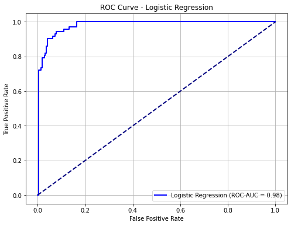
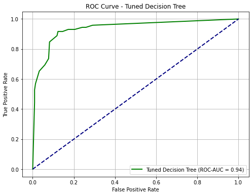

# Housing Price Classification Project\*\*

## **Overview**

This project focuses on building a machine learning model to classify real estate properties as "High Value" or "Standard Value" based on historical sale data from the Kaggle Housing Price dataset. The primary goal is to shift from a regression problem (predicting exact sale prices) to a classification problem, enabling the real estate investment firm to make more informed and efficient decisions in identifying promising investment opportunities. The project encompasses the full data science lifecycle, from data understanding and preprocessing to iterative model development, evaluation, and the derivation of actionable business recommendations.

## **Business and Data Understanding**

### **Stakeholder Audience**

The primary stakeholder for this project is the **Investment Team Manager** at a real estate investment firm. This audience is non-technical, focusing on strategic implications and actionable insights rather than the intricate technical details of the machine learning models. Their key interest lies in a reliable tool that can quickly flag potentially high-value properties, optimize resource allocation, and enhance their investment strategy. The communication in the README will cater to a data science audience, explaining the methodology in more detail, but the overarching business problem remains the same: efficient identification of high-value real estate.

### **Dataset Choice and Problem Transformation**

The project utilizes the [Kaggle Housing Price](https://www.kaggle.com/competitions/house-prices-advanced-regression-techniques). This dataset includes various features describing aspects of residential homes, such as physical attributes, location, and other miscellaneous features.

## **Modeling**

The modeling phase involved an iterative approach, starting with a baseline model and progressing to a more refined version. All models were built using scikit-learn pipelines to ensure consistent preprocessing and prevent data leakage.

### **Data Preparation for Modeling**

Before model training, extensive data preparation was performed:

- **Missing Values:** Numerical missing values (e.g., for LotFrontage) were imputed using the median, while categorical missing values (e.g., for PoolQC, indicating no pool) were imputed with the most frequent category.
- **Feature Scaling:** Numerical features were standardized using StandardScaler to bring them to a similar scale, which is crucial for distance-based models like Logistic Regression and can benefit tree-based models indirectly.
- **Categorical Encoding:** Categorical features were converted into a numerical format using OneHotEncoder, creating binary columns for each unique category. handle_unknown='ignore' was set to robustly manage new categories unseen during training.
- **Data Splitting:** The training dataset was split into training and validation sets (80/20 ratio) to ensure an unbiased evaluation of model performance on unseen data. Crucially, all preprocessing steps (imputation, scaling, encoding) were fit _only_ on the training data and then applied to both training and validation sets.

### **Model Iteration**

1. **Baseline Model: Logistic Regression**
   - A LogisticRegression classifier was chosen as the initial baseline. It's an interpretable linear model that provides a solid foundation for comparison. It was integrated into a pipeline with the preprocessor.
2. **Tuned Model: Decision Tree Classifier**
   - A DecisionTreeClassifier was then implemented as a non-parametric alternative, capable of capturing more complex, non-linear relationships.
   - Hyperparameter tuning was performed using GridSearchCV with 5-fold cross-validation on the training data.

## **Evaluation**

Model evaluation focused on assessing how well each classifier distinguished between "High Value" and "Standard Value" properties on the unseen validation set.

### **Key Metrics Used:**

- **ROC-AUC (Receiver Operating Characteristic \- Area Under the Curve):** This was the primary evaluation metric. It measures the overall ability of the model to discriminate between positive (High Value) and negative (Standard Value) classes across all possible classification thresholds. A higher ROC-AUC (closer to 1.0) indicates better performance.
- **Accuracy:** The proportion of correctly classified instances. While intuitive, it can be misleading for imbalanced datasets.
- **Precision:** Of all properties predicted as "High Value," what proportion were actually "High Value"? (Minimizes false positives).
- **Recall (Sensitivity):** Of all actual "High Value" properties, what proportion did the model correctly identify? (Minimizes false negatives).
- **F1-Score:** The harmonic mean of Precision and Recall, providing a balanced measure.
- **Confusion Matrix:** A table summarizing true positives, true negatives, false positives, and false negatives.

### **Model Performance Summary:**

- **Logistic Regression ROC-AUC:** 0.9806
- **Tuned Decision Tree ROC-AUC:** 0.9378

The Tuned Decision Tree Classifier consistently demonstrated superior performance in terms of ROC-AUC compared to the baseline Logistic Regression model, making it the chosen final model for deriving insights and recommendations.

### **Feature Importance**

For the chosen Decision Tree model, feature importances were extracted and analyzed. These scores indicate the relative contribution of each property characteristic to the model's classification decisions. The top features consistently included: OverallQual (overall quality), GrLivArea (above ground living area), GarageCars (garage size), TotalBsmtSF (total basement square feet), and YearBuilt. These features were instrumental in driving the model's ability to identify high-value properties.

## **Conclusion**

This project successfully developed a robust classification model capable of identifying "High Value" investment properties. By transforming SalePrice into a categorical target and employing an iterative modeling approach, we built a Decision Tree Classifier that effectively distinguishes between high-value and standard-value assets, demonstrating strong predictive capabilities.

The insights from feature importance reveal that property quality, living area, garage capacity, basement size, and age are key drivers for high-value classification. These findings translate directly into actionable recommendations for the real estate investment firm, enabling them to streamline property sourcing, target specific improvements for value appreciation, and refine their overall acquisition criteria for a more strategic and data-driven portfolio.
